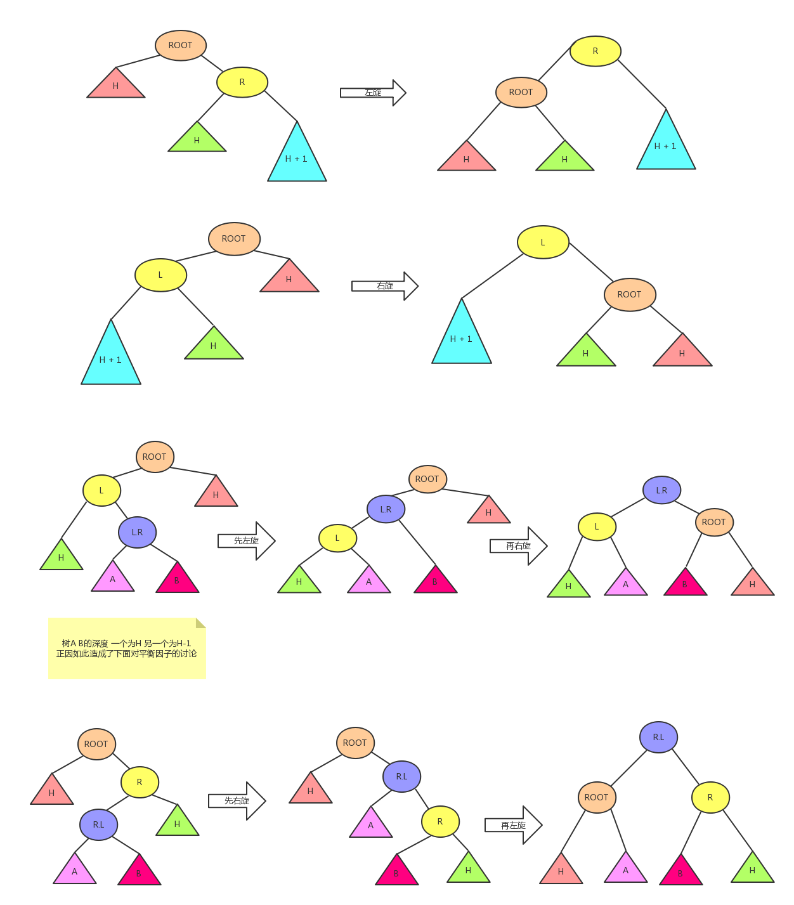

# README

<!-- TOC -->

- [README](#readme)
- [AVL树](#avl树)
    - [简介](#简介)
    - [性质](#性质)
    - [效率](#效率)
    - [实现](#实现)
        - [节点构成](#节点构成)
        - [插入](#插入)
            - [两个定义](#两个定义)
            - [原理](#原理)
            - [源码](#源码)

<!-- /TOC -->

# AVL树

## 简介
自平衡二叉查找树

## 性质
1. 左右子树的高度差绝对值不超过1。
2. 左右子树均为AVL树。

## 效率
插入/删除/查找均为O(logN)

## 实现
每个节点包含一个平衡因子 *(balance factor)*

### 节点构成
```golang
type Node struct {
	Val int
	L *Node
	R *Node
	bf int		// balance factory 定义为左子树高度减去右子树高度
}
```

### 插入

#### 两个定义
1. 旋转 由于AVL树的左右子树高度差小于等于1，每次插入时都可能需要通过旋转来维持两子树的高度差。旋转操作共分四种。
    - 左旋
    - 右旋
    - 左旋后右旋
    - 右旋后左旋

	

2. 平衡因子 *balance factor* 平衡因子为两子树的高度差，**只能**是-2 -1 0 1 2.

    > 约定：实现中平衡因子=左子树高度-右子树高度

#### 原理
1. 若根节点为空，初始化根节点，返回；若值与根节点值相同，返回。
2. 若值大于根节点值，对右子树递归调用插入函数；若小于，对左子树调用。
3. 刷新平衡因子。
    - 左子树从无到有或插入到左子树且左子树的平衡因子从0变为1/-1，则根节点平衡因子加一。
    - 右子树从无到有或插入到右子树且右子树的平衡因子从0变为1/-1，则根节点平衡因子减一。
4. 检测平衡因子，如果需要，则通过四种旋转恢复平衡。

    | 条件（插入在） |         平衡因子        |     操作     |    旋转后的平衡因子    |
    |:--------------:|:-----------------------:|:------------:|:----------------------:|
    | 左子树的左子树 |       BF/L.BF==2/1      |   直接右旋   |      BF/L.BF==0/0      |
    | 左子树的右子树 |  BF/L.BF/L.R.BF==2/-1/1 | 先左旋后右旋 | BF/L.BF/L.R.BF==-1/0/0 |
    |                | BF/L.BF/L.R.BF==2/-1/-1 |              |  BF/L.BF/L.R.BF==0/1/0 |
    | 右子树的左子树 |  BF/R.BF/R.L.BF==-2/1/1 | 先右旋再左旋 | BF/R.BF/R.L.BF==0/-1/0 |
    |                | BF/R.BF/R.L.BF==-2/1/-1 |              |  BF/R.BF/R.L.BF==1/0/0 |
    | 右子树的右子树 |      BF/R.BF==-2/-1     |   直接左旋   |      BF/R.BF==0/0      |

#### 源码
```golang
func (t *Node) Insert(val int) (*Node) {
	if t == nil {
		return &Node{
			val,
			nil,
			nil,
			0,
		}
	}

	if val > t.Val {
		// 插入到右子树
		if t.R == nil {
			// 右子树为空时
			t.R = &Node {
				val,
				nil,
				nil,
				0,
			}
			// 右子树从有到无 本节点的平衡因子减一
			t.bf--
		} else {
			// 右子树不为空时
			// 保存右子树的平衡因子
			rBfBeforeInsert := t.R.bf
			t.R = t.R.Insert(val)
			// 当右子树的平衡因子从0变化为1/-1 平衡因子减一
			if rBfBeforeInsert == 0 && math.Abs(float64(t.R.bf - rBfBeforeInsert)) > 0 {
				t.bf--
			}
		}

		if t.bf == -2 {
			if t.R.bf == -1 {
				// 刷新平衡因子
				t.bf = 0
				t.R.bf = 0
				// 左旋
				result := t.R
				t.R = result.L
				result.L = t
				return result
			} else {
				// 刷新平衡因子
				// 分析见表格
				t.R.L.bf = 0
				if t.R.L.bf == 1 {
					t.bf = 0
					t.R.bf = -1
				} else {
					t.bf = 1
					t.R.bf = 0
				}
				// 先在右子树上右旋
				newR := t.R.L
				t.R.L = newR.R
				newR.R = t.R
				t.R = newR
				// 再左旋
				result := t.R
				t.R = result.L
				result.L = t
				return result
			}
		}
	} else if val < t.Val {
		// 插入到左子树
		if t.L == nil {
			// 左子树为空
			t.L = &Node{
				val,
				nil,
				nil,
				0,
			}
			// 当左子树从无到有时 平衡因子加一
			t.bf++
		} else {
			lBFBeforeInsert := t.L.bf
			// 左子树不为空 递归插入
			t.L = t.L.Insert(val)
			// 当左子树平衡因子从0变成1/-1 平衡因子加一
			if lBFBeforeInsert == 0 && math.Abs(float64(t.L.bf - lBFBeforeInsert)) > 0 {
				t.bf++
			}
		}

		if t.bf == 2 {
			if t.L.bf == 1 {
				// 刷新平衡因子
				t.bf = 0
				t.L.bf = 0
				// 右旋
				result := t.L
				t.L = result.R
				result.R = t
				return result
			} else {
				if t.L.R.bf == 1 {
					// 刷新平衡因子
					t.bf = -1
					t.L.bf = 0
					t.L.R.bf = 0
				} else {
					// 刷新平衡因子
					t.bf = 0
					t.L.bf = 1
					t.L.R.bf = 0

				}
				// 先在左子树左旋
				newL := t.L.R
				t.L.R = newL.L
				newL.L = t.L
				t.L = newL
				// 再右旋
				result := t.L
				t.L = result.R
				result.R = t
				return result
			}
		}
	}
	return t
}
```